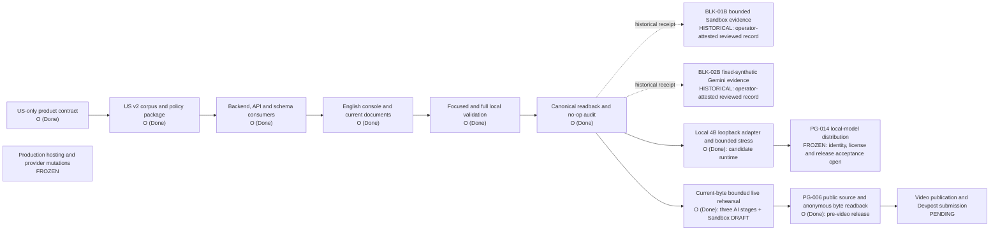
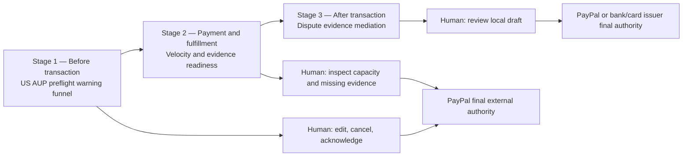
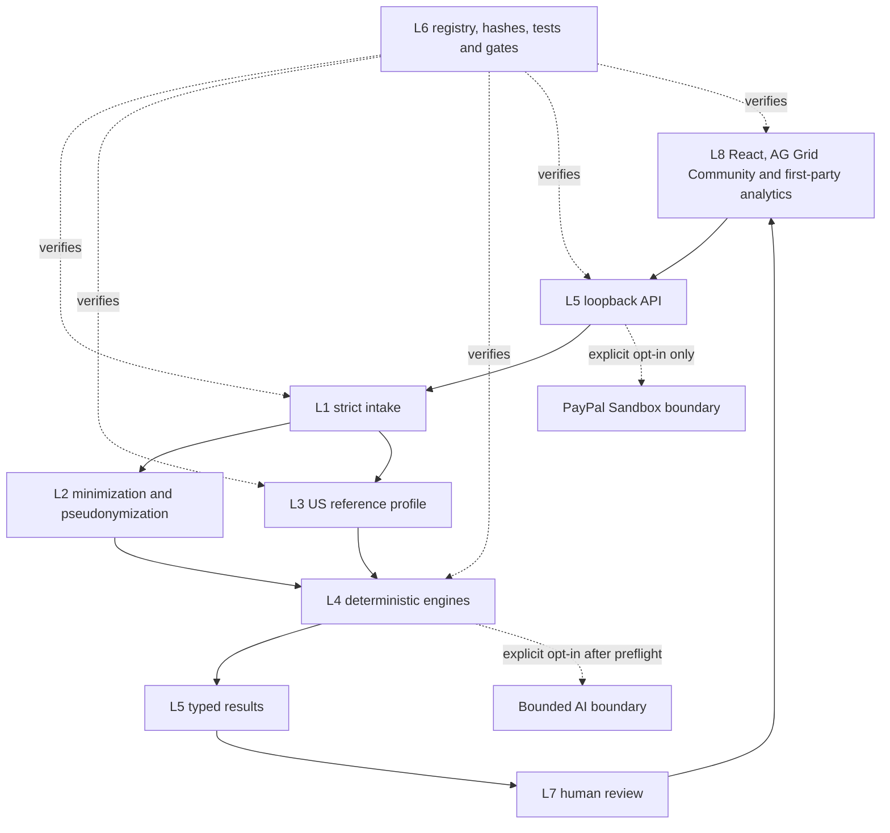

# PayGuard US-Only Eight-Layer Architecture

Status: accepted US-only local design. Prior operator-attested bounded Sandbox and Gemini receipts remain historical evidence for their own captured executions; they do not prove current-byte live behavior or bind a later source candidate. Release state is determined by the package manifest and exact anonymous public readback. When the manifest is `PUBLIC_SOURCE_PUBLISHED` with `publication_authorized=true` and the same bytes pass exact anonymous readback, public source publication is complete. In that published-source state, only video publication and Devpost submission remain in the competition submission path. A package marked `LOCAL_EXPORT_CANDIDATE_REVIEW_REQUIRED` has not crossed the public-source gate.

## Product boundary

PayGuard is an advisory merchant console for a United States PayPal Sandbox demonstration. It implements three linked stages:

1. pre-transaction US AUP preflight warning funnel;
2. payment and fulfillment velocity evidence readiness;
3. post-transaction dispute evidence mediation.

The architecture follows four authority rules:

- deterministic validation and routing run before optional AI;
- AI extracts and summarizes but does not choose jurisdiction, change a rule result or decide an outcome;
- humans control local edit, cancel, acknowledge and review choices;
- PayPal retains final authority for PayPal policy, account and internal-dispute decisions, while a bank or card issuer retains authority for an external dispute.

PayGuard does not freeze funds, approve compliance, predict hidden provider thresholds, submit evidence, send invoices, pay, capture, refund, appeal or adjudicate.

## Current status map

This graph describes the accepted local design and separates historical receipts from the separately reviewed current-byte rehearsal. The prior `BLK-01B` and `BLK-02B` receipts retain only their original bounded claims; a later sanitized receipt records three validated AI stages, one Sandbox OAuth and one unsent invoice DRAFT in a single session. Source publication is established only when the published manifest and exact anonymous readback agree. The complete repository run instructions are the selected functional-demo path. Video and Devpost remain pending; the optional hosted demo remains `FROZEN` and unperformed.

## Eight layers

| Layer | Modules | Responsibility | Current safe behavior | Open boundary |
| --- | --- | --- | --- | --- |
| L1 — Ingest | `M-INGEST` | Validate event source, request kind, identifiers, timestamps, required fields and deterministic route | Accept bounded synthetic input and an explicit US context; reject unsupported or ambiguous routes | Authentic provider event ingestion and durable replay inbox remain open |
| L2 — Privacy | `M-PRIVACY` | Minimize, pseudonymize and classify sensitive fields | Process fixed synthetic evidence in memory; return redacted text and limited metadata | Real PII, vault, retention enforcement and complete recall remain open |
| L3 — Policy | `M-POLICY` | Load a versioned policy profile, bind source identity and preserve time semantics | Load one pinned US `REFERENCE_ONLY` package; effective interval and account applicability stay unestablished | Full rule lifecycle, promotion, legal review and account-specific applicability remain open |
| L4 — Engines | `M-ENGINES` | Run deterministic AUP, velocity, completeness, retrieval and advisory gates | Emit warnings, local anomaly signals, missing evidence and bounded citations; the current-byte rehearsal validated one bounded AI response per fixed stage | Full declarative interpretation, repeatability, semantic quality beyond the fixed samples and real-record behavior remain open |
| L5 — API and Report | `M-API`, `M-REPORT` | Enforce strict HTTP/I/O contracts and present backend-owned calculations | Loopback session/CSRF/quota controls; no frontend risk recomputation; fixed sanitized errors | Provider telemetry, separate readback and durable external action records remain open |
| L6 — Governance | `M-GOVERNANCE` | Bind files, hashes, tests, source provenance, evidence and release state | One registry, one gap queue, isolation-first change, strict audit, no-op verification and historical readback preserved for its own bytes | Every changed release requires a matching manifest, release evidence and exact anonymous public readback; production deployment requires separate acceptance |
| L7 — Human Review | `M-REVIEW` | Bind actor choice to case/action/payload digest, nonce and expiry | Short-lived local acknowledgement and draft review; edit/reset/expiry revoke prior approval | Durable authenticated actor, tenant and restart/concurrency semantics remain open |
| L8 — Presentation | `M-PRESENT`, `M-UI` | Render backend state, references, limitations and operator controls | English US-only console, AG Grid Community, a lazy-loaded first-party analytics workspace, a four-column backend-supplied transaction stream, single-open mobile evidence accordion and a deterministic local dashboard guide | Repository instructions are the selected demo path; same-version public artifact proof requires manifest binding and exact anonymous readback; optional hosted judge access remains frozen and unperformed |

## Three-stage lifecycle

### Stage 1 — US AUP preflight warning funnel

Input: a bounded synthetic product or service description plus explicit US policy context.

Processing order:

1. validate required fields and format;
2. run deterministic term/category matching against the pinned US AUP reference;
3. produce `NO_MATCH` or `REVIEW_SIGNAL` with `compliance_decision=NOT_MADE`;
4. show source identity, visible source date, limitations and the official link;
5. let the merchant edit, cancel, or acknowledge and continue to ordinary provider-gated review;
6. optionally request a bounded AI summary after deterministic validation;
7. leave every external policy and provider decision to PayPal.

Required-field validation may stop an incomplete local draft. The AUP warning does not create a local compliance hard block. A no-match does not grant clearance.

### Stage 2 — Fulfillment and velocity evidence readiness

Input: bounded synthetic transactions, a documented local baseline and fulfillment evidence fields.

The backend calculates count, value and ratio inside a defined observation window against a declared preceding baseline window. It may emit `review_velocity`. The result means only that the local demonstration threshold was exceeded or the local input contract requires review.

The UI uses the official terms `hold`, `limitation` and `reserve` when explaining public policy. It never labels the result as AML, money laundering, fraud, PayPal risk score or provider threshold. Tracking may be relevant, but PayPal retains discretion over any provider action or release.

### Stage 3 — Dispute evidence mediation

Input: a bounded synthetic provider-response fixture plus separately bound synthetic proof records and attachment bytes, or, in a future separately authorized adapter, current provider case details.

The deterministic resolver validates reason, lifecycle stage, status, seller-response due date, normalized available actions, current evidence requests, request source, evidence joins, chronology, file signatures, file types and file-size limits. A seller requirement is created only when the current request has both `source=REQUESTED_FROM_SELLER` and `action=PROVIDE_EVIDENCE`; null or unknown actions remain context-only. Static reason templates never invent a missing request.

The runtime produces two bounded products. Restricted original synthetic metadata remains in expiring session memory and never returns file content or raw provider case, order or request identifiers to the browser. Browser views use non-identifying session references such as `case-ref-001`, `order-ref-001` and `requirement-001`. A separate `INTERNAL_REVIEW_ONLY_V1` pseudonymized JSON copy may be downloaded for local review. The browser can also package the same safe projection into a deterministic six-entry `INTERNAL_REVIEW_ZIP_V1` archive with a fixed README, manifest, requirement projection, timeline, pinned public sources and pseudonymized evidence. The completed archive is parsed before download; fixed authority values, canonical JSON, ZIP metadata and per-payload byte length, CRC-32 and SHA-256 must all match. The ZIP excludes restricted originals, raw identifiers, proof values, attachment names and attachment bytes, and it never represents a PayPal submission package.

Before reuse, AI eligibility or local approval, the backend recomputes and constant-time checks the restricted object digest; the draft digest then binds the browser-visible draft to that verified hidden-layer digest. The console does not consume live PayPal disputes, route cases by adjudicator, persist real PII, submit evidence or select an external response. Raw HATEOAS links, PayPal `allowed_response_options` and live authority routing remain provider-adapter fields. PayPal or the issuer retains the applicable external authority.

## Data and control flow

The browser never receives credentials or access tokens. Provider records never enter the synthetic pool. AI does not receive real merchant, buyer, payment or dispute data in the current scope.

## US source architecture

The active evidence profile is `data/knowledge/payguard_us_official_v2/`:

- `sources.json` contains 16 official source identities;
- `chunks.jsonl` contains 29 bounded English paraphrase chunks;
- `scenario_cards.v1.json` contains three synthetic scenario cards.

Sources have three distinct roles:

| Source class | Role | Authority limit |
| --- | --- | --- |
| Official PayPal US policy | Explain public US policy categories and program terms | Does not establish account-specific applicability or a compliance verdict |
| Jurisdiction-neutral PayPal Developer documentation | Explain Sandbox, API fields and process | Does not become US law, account eligibility or action authorization |
| Official U.S. court procedural record | Provide historical procedural context | Does not become current policy, individual merits truth or a deterministic risk label |

Unsupported jurisdictions fail request validation before any package or corpus access. There is no cross-region fallback. Jurisdiction-neutral technical material cannot satisfy US policy coverage.

## Policy time and state semantics

- `retrieved_at` records when the public source was observed.
- `source_updated_date` records a visible page date when present.
- `effective_date` remains unknown unless the source establishes it.
- observation freshness does not establish legal effectiveness.
- lexical relevance does not establish confidence, applicability or truth.
- `REFERENCE_ONLY` cannot transition an external provider state.

Every policy output retains `current_policy_applicability=NOT_ESTABLISHED`, `compliance_decision=NOT_MADE` and `external_action_authorized=false` unless a future separately governed system introduces stronger evidence and authority.

## Sandbox and model boundaries

### `BLK-01B` — bounded external Sandbox evidence

The maximum separately reviewed evidence scope is:

- operator-visible confirmation of an eligible US Business sandbox seller;
- Invoicing availability for that seller;
- one sanitized OAuth result;
- one sanitized unsent invoice `DRAFT` creation result;
- independent review of identity, endpoint, request class and response evidence.

The existing login is only the Developer-login identity. A virtual Business sandbox seller is not the operator's live account. A create response is not a separate GET readback. Invoice send, payment, capture, refund and production are frozen.

### `BLK-02B` — bounded external model evidence

The maximum separately reviewed evidence scope is:

- the fixed bounded synthetic input and exact citation identities;
- the actual model identifier and sanitized response;
- proof that no real business or personal data was sent;
- structural validation and human semantic review;
- preserved `NOT_MADE`, `NOT_ESTABLISHED` and no-action authority.

The source contract permits one Vertex `v1` invocation of `gemini-3.8-flash` in `global`, no automatic retry and no persisted raw response, credential, project identity or environment. The source package alone does not prove that invocation occurred; the historical `BLK-02B` receipt establishes one bounded fixed-synthetic execution only for its captured provider run and does not establish current-byte live behavior. The runtime adds a process-local three-attempt budget with one permanent reservation per fixed stage. Deterministic readiness and reservation occur atomically before a provider call; every attempted downstream outcome consumes the reservation. The prompt and its SHA-256 identity are server-owned, caller requests contain only the stage enum, and model output is limited to closed stage-specific sentence enums and fixed citation identities. Tools, function calling, retrieval, streaming and caller overrides are unavailable. This protection does not survive process restart or span multiple workers, so any public distributed deployment remains blocked until a durable shared atomic quota and gateway cost circuit breaker are independently verified.

### Local 4B candidate runtime

The default-off LM Studio adapter is fixed to the locally installed `nvidia-nemotron-3-nano-4b` model at `127.0.0.1:1234`. It uses the same fixed synthetic context, prompt digest, sentence enums and citation identities as the Gemini line. The transport disables environment proxies and redirects, requests structured JSON with `reasoning_effort=none`, exposes no tools, serializes inference and performs no retry or provider fallback.

The public source includes bounded synthetic contract tests for all three stages and repeat-request rejection. These tests do not establish a live local-model execution, replace Gemini, expand `BLK-02B` or authorize public deployment. Exact model-weight digest, license review, restart and hardware repeatability, public-host quota and independent release acceptance remain open boundaries.

## Gap ownership

| Gap | Boundary | Current consequence |
| --- | --- | --- |
| `PG-001` / `BLK-01B` | One bounded Sandbox OAuth plus unsent invoice `DRAFT` pair | The historical receipt retains its original scope; a separate current-byte rehearsal confirmed one OAuth and one unsent DRAFT through source-bound sanitized receipts. Independent provider telemetry, separate GET, send, payment, production and broader account behavior remain unavailable |
| `PG-002` / `BLK-02B` | One bounded `gemini-3.8-flash` execution and human semantic review | The historical receipt retains its original scope; a separate current-byte rehearsal validated one bounded response for each fixed stage. Repeatability, semantic quality beyond those samples, real-record behavior and the optional full policy interpreter remain outside the claim |
| `PG-003` | Durable external submission authority | Review remains local and short-lived |
| `PG-004` | Real PII ingestion and retention | Only synthetic bounded privacy demonstrations are allowed |
| `PG-006` | Pre-video public source release | Current-byte live proof, same-version release evidence and exact anonymous public readback are accepted for this bounded source release. Video publication and Devpost submission remain separate pending actions; optional hosting remains unperformed and is not mandatory |

Internal machine-readable registries remain local release-owner controls and are not linked from the public package. Public documents cannot close a release gate.

## Accepted local baseline and external promotion conditions

The accepted US-only local baseline has direct evidence that:

1. active runtime, data, policy, UI and docs contain no foreign policy/case selector, source or fallback;
2. unsupported jurisdiction requests fail before loader access;
3. official source identities, dates, classes, limitations and hashes validate;
4. deterministic warning, velocity and dispute contracts remain unchanged in authority;
5. AI remains post-validation and advisory;
6. focused and full tests, frontend build, rendered desktop/mobile/keyboard review, audit publication, second no-op audit and canonical readback pass;
7. historical logs, receipts and superseded bytes remain unchanged;
8. video publication and Devpost submission remain separate evidence-driven pending actions.

The historical bounded Sandbox and Gemini receipts remain evidence only for their captured executions; the separately reviewed current-byte rehearsal supports exactly its three fixed AI stages, one Sandbox OAuth and one unsent invoice DRAFT. Complete repository run instructions are the selected functional-demo path. Each published candidate still requires matching release evidence and exact anonymous public readback before it can carry `PUBLIC_SOURCE_PUBLISHED`. After that same-byte readback, only video publication and Devpost submission remain in the competition submission path. Optional hosting remains frozen and unperformed, and public or production hosting plus multi-user AI operation remain unproven and outside the accepted runtime.

Stop if a source digest drifts, a foreign source becomes reachable, an effective date is inferred, a procedural court record is presented as a merits decision, a synthetic receipt is called authentic, or any path enables production or financial mutation.

See the [standalone architecture/status visual](payguard_us_architecture_status.svg), [source register](us_official_source_register.md) and [US mainline contract](us_mainline_contract.md).
