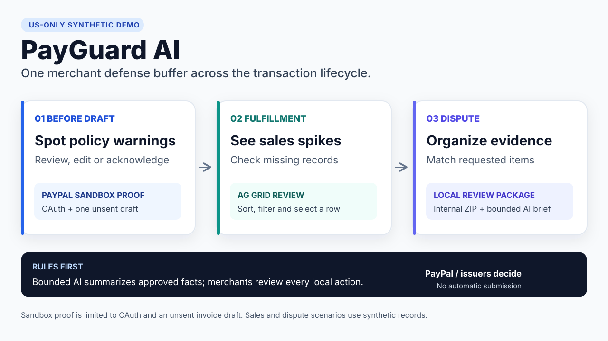

# PayGuard Judge Quickstart

This walkthrough uses synthetic data and a US-only official-reference profile. It does not require a new outbound provider call. Any recorded provider or model evidence supports only its exact sanitized request and response.



For the competition recording sequence and exact opening narration, see [PayGuard AI Demonstration Script](video_script.md).

The [published 2:02 demonstration](https://youtu.be/K28N9QhRp1E) is the final edited video. The script preserves the longer pre-edit recording plan; its timestamps are not final-cut seek positions.

Status: the complete repository run instructions in this document are the selected functional-demo path. A hosted demo URL is optional and unperformed. The 2:02 video is public. The default export records `LOCAL_EXPORT_CANDIDATE_REVIEW_REQUIRED` with final-byte security review, independent red-team acceptance, repository visibility and Devpost submission still gated. After this source candidate is published and its exact bytes pass anonymous readback, `--published-source` records `PUBLIC_SOURCE_PUBLISHED` with only Devpost submission remaining. Neither state establishes a public or production-hosted service.

## Start the console

From the repository root:

Windows users must run these POSIX `sh` commands in WSL 2; native Command Prompt and PowerShell runners are not supported.

```sh
python3.13 -m venv .venv
uv pip install --python .venv/bin/python3 -r requirements.lock
./tools/run.sh test
./tools/run.sh api
```

The Gemini profile is optional and is not required to start or judge the deterministic console. To validate it separately:

```sh
uv venv --python python3.12 integrations/gemini/.venv
uv pip sync integrations/gemini/requirements.lock --python integrations/gemini/.venv/bin/python3 --require-hashes
./tools/run.sh gemini-check
./tools/run.sh gemini-test
```

In a second terminal:

```sh
cd frontend
npm ci --ignore-scripts --no-audit --no-fund
npm run dev
```

Open `http://127.0.0.1:5173`. Keep both processes running. If the API is unavailable, the UI fails visibly instead of loading a hidden mock.

This loopback walkthrough is the selected functional-demo path. It does not establish a public or production-hosted service.

## Understand the banner before the demo

The target market is the United States. The provider environment is PayPal Sandbox. The existing PayPal login is only the Developer-login identity. A fictitious Business sandbox account represents the merchant, and a fictitious Personal sandbox account represents the buyer when needed.

Any separately reviewed Sandbox proof must identify a US Business Sandbox seller and confirm Invoicing only for that bounded path. This source package does not establish the operator's live-account type or production eligibility. No credential should appear in the browser, repository, prompt, screenshot or report.

For a recorded take, start a fresh backend so each stage has its single available AI attempt. Configure Sandbox credentials off-screen, expand **Optional PayPal US Sandbox connection**, and select **Connect US Sandbox**. The recorded primary view must show **Live Sandbox connection verified** and **Live Sandbox response** without an account, token, invoice identifier or technical receipt.

## Three-stage walkthrough

### Stage 1 — US AUP preflight screen

1. Open **STEP 01 AUP preflight**.
2. Select **High-risk Claim**, then **Run Policy Check**. Confirm that the result is `REVIEW_SIGNAL` and the official PayPal US AUP link is visible.
3. In the already-open **Optional PayPal US Sandbox connection** section, check **I reviewed the description and amount and confirm that this action creates a Sandbox draft only.**, then select **Confirm Draft Context**. The warning dialog now opens.
4. In the warning dialog, verify the three available choices: **Return to edit**, **Cancel flow**, and **Acknowledge and continue**.
5. For the recording path, select **Return to edit**. Confirm that the prior result, acknowledgement, draft binding and confirmation checkbox are cleared.
6. Select **Standard Item**, then run the policy check again. Confirm **No demo rule matched**. Expand **How this result was checked** to inspect **No decision made** and **Not established**.
7. Treat `NO_MATCH` only as no configured demo keyword match. It is not compliance clearance and does not mean compliant, allowed, approved, legal or safe.
8. Check the human confirmation again, select **Confirm Draft Context**, and then select **Create Sandbox draft**.
9. Confirm **Sandbox invoice draft created**, **Draft · not sent**, and **Not submitted**. No invoice identifier may appear.

Expected boundary: PayGuard surfaces a public-policy category and a warning. It does not declare the product compliant, prohibited, legal, approved or safe. It does not send an invoice.

### Stage 2 — Fulfillment and velocity evidence readiness

1. Select **Next: sales burst**. Confirm STEP 01 closes, STEP 02 opens, and the page scrolls naturally to it.
2. Select **Load sales burst** and confirm the backend-calculated ratio and capture count. Expand **How this signal was calculated** to inspect the **Synthetic baseline**, preceding comparison window and UTC labels.
3. In the core AG Grid, sort the **AMOUNT** column.
4. Use **Filter transactions** to reduce the visible rows to one known order, then clear the filter and confirm all 50 rows return.
5. Select one transaction and inspect its order reference, amount, currency and captured-at UTC value.
6. Confirm the card labels its value as **Stage evidence checklist** and says the stage signal does not classify the selected order as fraud or predict PayPal action.

Expected boundary: the signal means the synthetic activity exceeded a local demonstration baseline. It is not a PayPal threshold, risk score, AML finding, fraud finding or prediction of a hold, limitation, reserve or release. Tracking may be relevant evidence but cannot guarantee release or program eligibility.

### Stage 3 — Dispute evidence mediation

1. Select **Next: dispute evidence**. Confirm STEP 02 closes, STEP 03 opens, and the page scrolls naturally to it.
2. Select **Load dispute case** and select the case.
3. Select **Prepare evidence draft**.
4. Inspect the response deadline and readiness in the primary view. Expand **Evidence fields, requested items, and ZIP contents** to inspect **Proof of fulfillment**, **Requested from seller**, requirements, original-identifier summary, and six ZIP members.
5. Confirm the details say **Original identifiers stay in this demo session** and **No original file content is included, and nothing is submitted externally.**
6. Select **Download review file** and confirm the provider-submission boundary remains **Not submitted**.
7. Select **Download review ZIP**. Confirm its visible short warning says the review copy is not a PayPal attachment and was not submitted; expand **What this review copy does not prove** for the full boundary. The fixed archive contains a README, manifest, response-driven requirements, timeline, public citations and pseudonymized evidence; it contains no raw case ID, order ID, request ID, identity token, session ID, draft digest, proof value, attachment name or attachment bytes.
8. Check the human-review box and record the local review.

Expected boundary: the draft remains local and synthetic. PayGuard does not submit evidence, message a buyer, make an offer, accept a claim, refund, appeal or adjudicate. PayPal decides escalated internal claims. A bank or card issuer decides an external dispute, with PayPal acting as intermediary.

## Sponsor analytics walkthrough

On a desktop viewport wider than 720px:

1. Select **Grid analytics**. The AG Grid Community workspace opens through the explicit navigation action.
2. Confirm that **Review overview** shows the three-stage review path, authority map, session evidence counts and transaction table.
3. Use **Filter visible rows**, column sorting and column filters to inspect the synthetic rows. Confirm that the grid does not recalculate workflow status.
4. Select **Transaction table** and verify that the grid moves to the primary review position without changing row identity or backend state.
5. Use **What needs attention?**, **Explain authority** and **Summarize snapshot**. Confirm that the deterministic local guide performs no external request and cannot send an invoice, move money, submit evidence or decide an outcome.

On a viewport 720px wide or narrower:

1. Expand **Merchant Evidence Buffer** and select **Launch analytics**. The responsive evidence summary opens; the desktop AG Grid table, mode switch and guide controls are not shown at this width. At 641–720px, the **Grid analytics** navigation link also opens this summary; at 640px or narrower, the top navigation is hidden.
2. Confirm that the single-column review summary starts on the three-stage lifecycle. Opening item counts, the compact transaction preview or the authority map closes the prior accordion section. To demonstrate AG Grid sorting and filtering, use a viewport wider than 720px.

Expected boundary: the analytics workspace presents validated synthetic workflow status through AG Grid Community and first-party React components. The local guide never changes the AUP, velocity or dispute results. The exact source-release state comes from the export manifest; the video is public and Devpost submission remains open.

## Optional AI evidence brief

After rule checks, each stage may expose **Generate AI brief**. This action uses approved synthetic facts and fixed source references. The primary result shows the model, mapped execution label, one evidence point, one missing item, source references, **HUMAN REVIEW REQUIRED**, and **No external action authorized**.

The strict API contract still retains:

- `compliance_decision=NOT_MADE`;
- `current_policy_applicability=NOT_ESTABLISHED`;
- `semantic_entailment=NOT_EVALUATED` until human review;
- `external_action_authorized=false`.

The UI validates closed model and evidence identity pairs. The default Gemini line uses `gemini-3.8-flash` with `SYNTHETIC_TEST_RESPONSE` or the separately evidenced `OPERATOR_LIVE_RESPONSE` class. Any prior external result is operator-attested; a judge-facing execution claim requires showing the bounded path live. The explicit local line uses `nvidia-nemotron-3-nano-4b` with `LOCAL_RUNTIME_RESPONSE`. Enum support in source does not establish an external execution. The backend launcher selects one line for the process; the browser cannot select a provider and no automatic fallback calls the other line. Neither identity authorizes a provider or workflow action.

## Public references and case caveat

The active source profile contains official PayPal US policy pages, jurisdiction-neutral Developer documentation and two official U.S. court procedural records. The court records describe settlement approval or arbitration procedure. They do not establish final individual merits, current policy or a provider threshold.

No reviewed official case proves that rapid sales growth alone caused an account limitation. The narrower supported statement is that the public US User Agreement lists rapidly increasing typical sales volume among multiple risk examples and says some criteria are confidential.

## Optional bounded Sandbox evidence

Any `BLK-01B` result remains operator-attested and external to this source package unless the bounded path is shown live. It must be operator-authorized, sanitized and independently reviewed. Its maximum scope is one Sandbox OAuth result plus one unsent USD `10.00` invoice `DRAFT` creation result.

- Use a fictitious Business sandbox seller for the merchant role.
- Confirm its country as US before calling it a US seller.
- Confirm Invoicing availability before attempting the draft.
- Keep outbound access off until the operator explicitly enables the bounded attempt.
- Do not retry an uncertain successful create automatically.
- Do not send the invoice or perform payment, capture, refund or dispute mutation.

Mock transport, screenshots and local UI state do not count as authentic provider evidence.

## Verification commands

```sh
./tools/run.sh test
./tools/run.sh demo
./tools/run.sh evaluate
npm --prefix frontend run build
node tests/frontend_ai_contract.mjs
node tests/frontend_operator_labels.mjs
node tests/frontend_recording_contract.mjs
node tests/frontend_zip_contract.mjs
node tests/frontend_zip_api_parity.mjs
```

Optional Gemini-profile validation remains separate:

```sh
./tools/run.sh gemini-check
./tools/run.sh gemini-test
```

These commands validate the local runtime and source contract. The export manifest records the exact source-release state. No verification command authorizes a provider action.

## What the deterministic console demonstrates

- A deterministic warning funnel can surface public US AUP categories before an invoice draft.
- A backend calculation can show a local velocity anomaly against a declared synthetic baseline and preceding comparison window.
- A deterministic intake can organize a synthetic dispute and produce an integrity-checked internal review ZIP while preserving the correct adjudicator boundary.
- A bounded AI adapter can be placed after deterministic validation without receiving decision authority.

## What the demo does not establish

- The operator owns or qualifies for a US live account.
- A selected sandbox seller is US or Invoicing-enabled without readback.
- PayPal will approve a product, prevent a limitation, release funds or decide a dispute in a particular way.
- Evidence is authentic, sufficient or eligible merely because all local fields are complete.
- Authentic Sandbox or model execution unless shown live, model repeatability, real-record model behavior, production readiness or public-submission readiness.
- Public or production hosting, restart-safe multi-user AI operation or a hosted-demo URL.

See the [current architecture](../decisions/2026Q4/architecture.md), [official source register](../decisions/2026Q4/us_official_source_register.md) and [US mainline contract](../decisions/2026Q4/us_mainline_contract.md).
